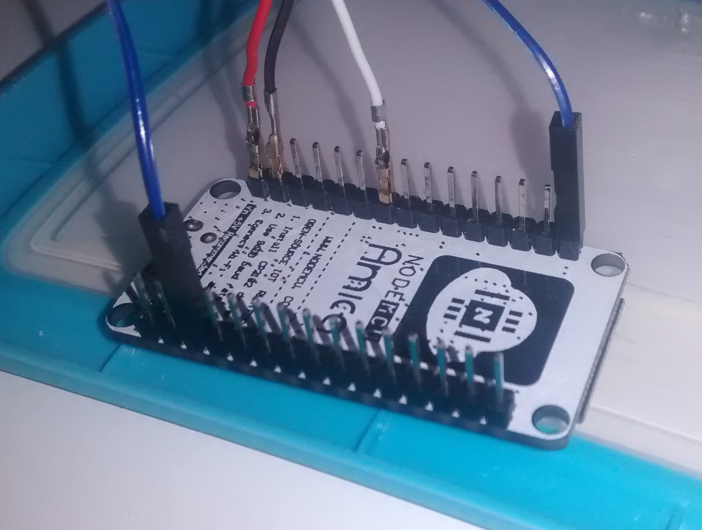

Zeigometer
==========

The zeigometer is an autonmous device that can show a value on a
scale. It can be made of a an ESP8266, a servo motor, a powerbank and
some housing - I used an ice-cream package for this.

The servo motor is connected to an ESP8266, reads analog values from a
web ressource and  sends the value to a servo that visualizes the value
on a scale. The project is mainly inspired by the
[pingo meter project](https://www.raspberrypi.org/magpi/pingometer/)
from the Raspberry Pi Magazine.

Process Sequence
----------------

Here is what the device actually does.

1. Power on
2. Connect to a pre-configured Wifi-AP
3. Fetch a value from a pre-configured web ressource. The ressource
   can be a file on a webserver. I should only contain an integer
   value between 0 and 100.
4. Adjust the needle connected to a servo motor to reflect the value -
   0=left, 100=right.
5. Go into deep sleep for some pre-configured period of time.
6. Awake and start from the beginning.

Sketch
------

- The servo is connected to the VCC and Ground for power supply.
- GPIO12 (or what ever is configured) is used as PWM pin for
  controlling the servo.
- GPIO16 and RESET are connected to awake the ESP8266 from deep sleep
  mode. GPIO16 is the only pin that can be used for this purpose.
- Power supply via VIN. Since this pin is controlled by a power
  regulator, up to 10V can be used.

Configuration
-------------

Move [config_sample.py](config_sample.py) to `config.py` and adjust
the values. The file contains comments that explain what the values
actually mean.

Installation
------------

The ESP8266 needs to be
[flashed with a Micropython firmware](http://docs.micropython.org/en/latest/esp8266/esp8266/tutorial/intro.html#deploying-the-firmware).

Transfer all python files onto the ESP8266. A tool
like [ampy](https://github.com/adafruit/ampy) helps a lot during this
process.

Making
------

The servo is hosted in a plastic ice-cream package. A hole was
drilled to stuff the motor through. The servo itself is glued to the
cover with hot glue.

Finally a scale is made that hides the shitty cover. Here is
the [template file](doc/scale_template.svg) for this.

Powering
--------

As the the device should work autonomously it still needs some
power. The easiest way to do this would be to use a small
powerbank. However, since the ESP8266 has very low power consumption
of about 20 µA in deep sleep mode, the powerbank may turn itself off
automatically.

The VIN pin of the nocdemcu devkit is connected to a power
regulator. Therefore a 9V battery can be attached to power the board.

An
[article at Henry's Bench](http://henrysbench.capnfatz.com/henrys-bench/arduino-projects-tips-and-more/powering-the-esp-12e-nodemcu-development-board/) 
explains different possibilities in powering the nodemci-devkit board.
